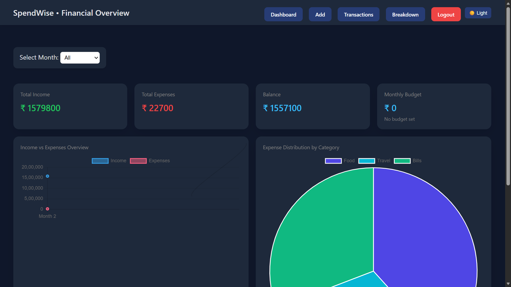
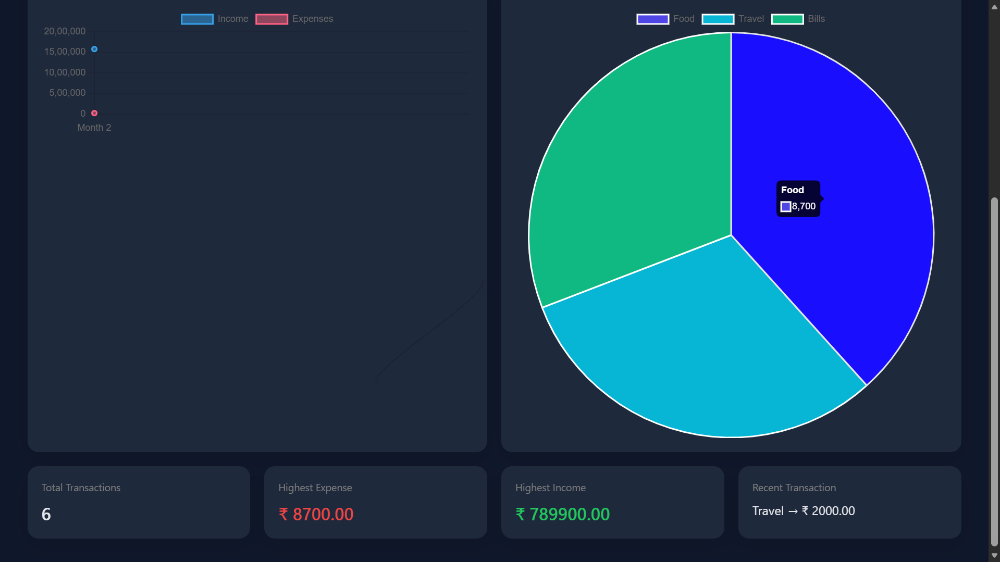
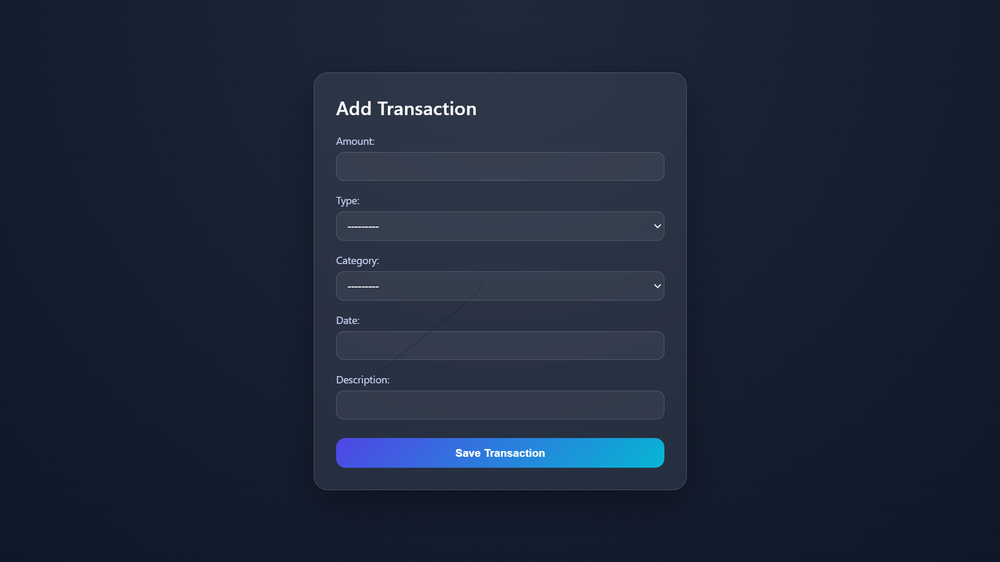
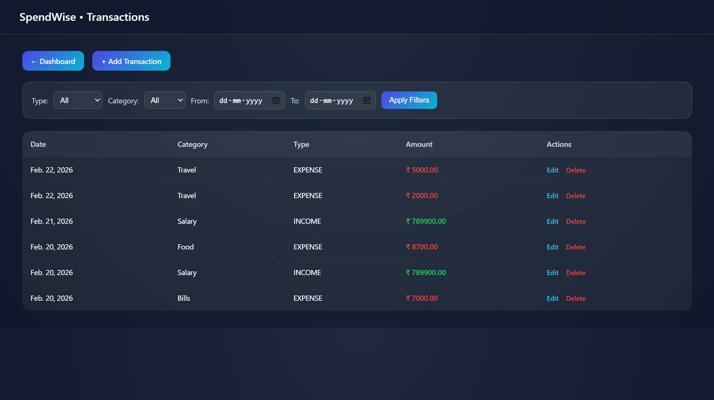
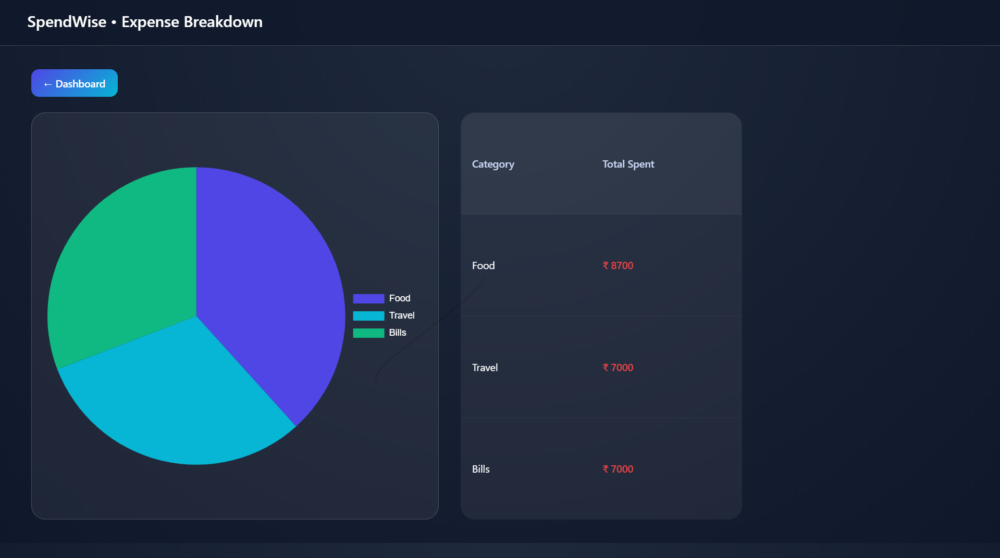
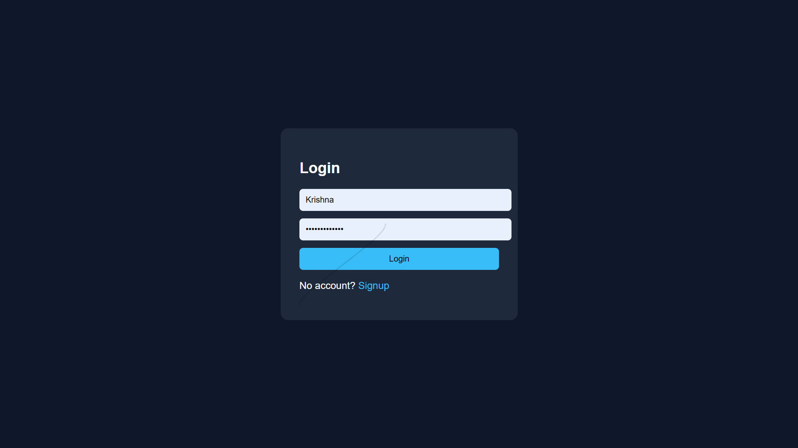
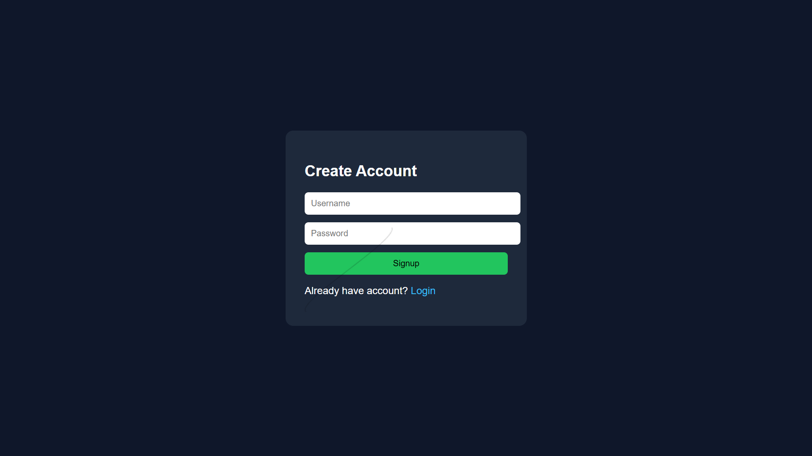

# smart-expense-tracker
Personal finance management web app built with Django. Features include income/expense tracking, monthly analytics, category breakdown, budget monitoring, and interactive charts.
## 📸 Application Screenshots

### Dashboard

### Add Transaction

### Transactions

### Category Breakdown

### Authentication

